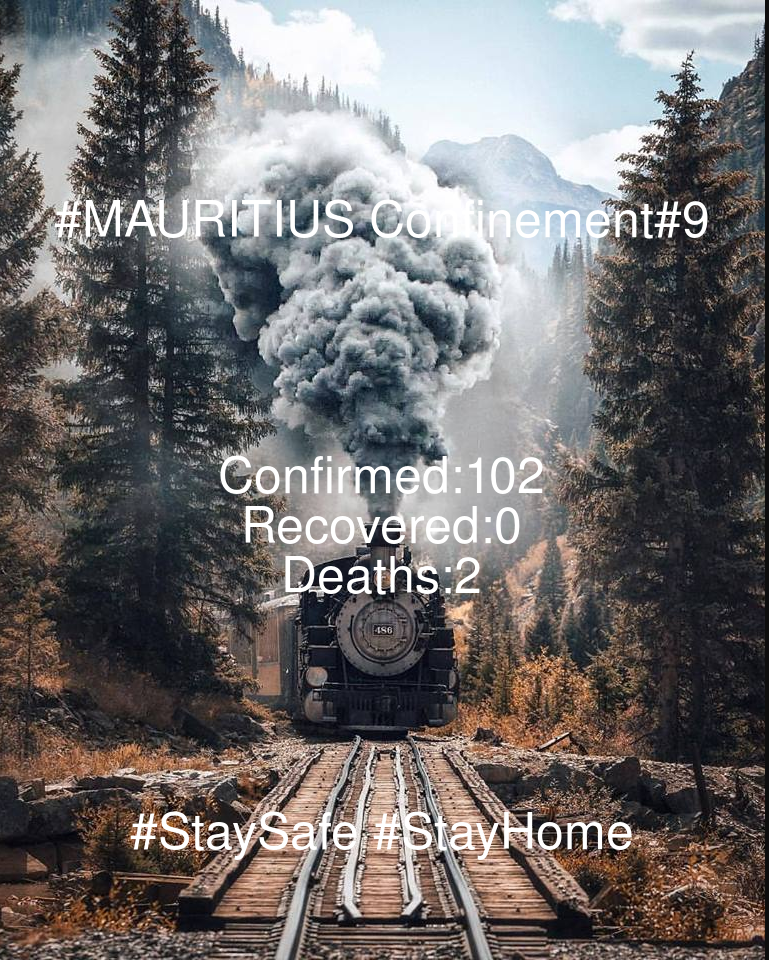
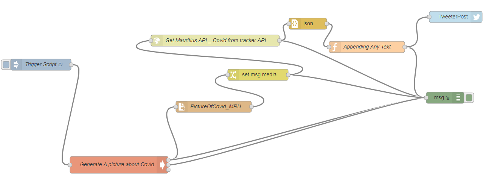

# Tweet-CovidPictures-MRU

Get  a picture from Reddit about nature
then write stats about latest information for mauritius in the picture
Post picture to Tweeter

# Requirements
- Imagemagick
- Bash
- Nodered Installed
- Twitter Node for Nodered
- Twitter Access Tokens from Twitter

# Flow 
- Nodered executes the script bash to get a picture from Reddit NaturePics 
- Gathers data from Covid Tracker API to get stats about Mauritius
- Write the stats on the image using imagemagick command "convert"
- Save the picture on a path
- Load the picture as a buffer stream on Nodered
- Add the parameter msg.media -> which will allow twitter node to post the picture
- Get Stats about the API from covid tracker API and put it as Status Text on the tweeter post
- Appending Any text function will get the exact text for tweeter posting
- Finally tweet the image along the the Text

 
